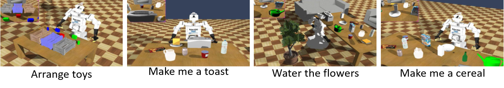
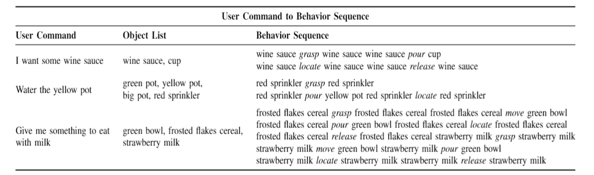

# Order2Taskplan-pytorch

This is a PyTorch implementation of the Episodic memory module described in our IROS 2018 paper ["Adaptive Task Planner for Performing Home Service Tasks in Cooperation with a Human"](http://rit.kaist.ac.kr/home/International_Conference?action=AttachFile&do=get&target=paper_0417.pdf).
Please note that this repository contains only the implementation of the episodic memory module(the deep learning part) in the paper.


## Dataset
* Total 50,000 input-output pairs (Train: 45,000, Test: 5,000)
* Ten robot behaviors: _grasp_, _throw_, _locate_, _release_, _move_, _pour_, _put_, _push_, _sprinkle_, and _squeeze_
* Every pair is related to one of these four scenarios:
 


* Example



## Requirements
* Ubuntu 16.04+ 
* Python 3.6+
* Pytorch 0.3.1+
* Torchtext
* Numpy
* Matplotlib

## Installing Order2Taskplan-pytorch

Order2Taskplan requires Python 3.6 or higher. It also requires installing PyTorch 0.3.1+ (warnings occur on 0.4.0). Its other dependencies are listed in requirements.txt. CUDA is required.

Run the following commands to clone the repository and install Order2Taskplan:
```
git clone https://github.com/chickenbestlover/Order2Taskplan-pytorch.git
cd Order2Taskplan-pytorch; pip install -r requirements.txt
```

## Training
* Step 1: Train Order2Taskplan model:
```
CUDA_VISIBLE_DEVICES=0 python 1_train_order2taskplan_model.py
```

* Step 2: Train Hallucination model(optional, required if you don't want the user command(order) input):
```
CUDA_VISIBLE_DEVICES=0 python 2_train_hallucination_model.py 
``` 
* We also provide pretrained models: [1_best_model.pt](https://drive.google.com/open?id=1ZD2qMtljhl2jYK1OxEPIk8Yo8zpsC9TJ), [2_best_model.pt](https://drive.google.com/open?id=1RtHr5ebhUu6psyYwGMEgpyxYrIEFbo5t)


## Citation

Please cite the IROS 2018 paper if you use Order2Taskplan in your work:

```
@inproceedings{lee2018taskplan,
  title={Adaptive Task Planner for Performing Home Service Tasks in Cooperation with a Human},
  author={Lee, Seung-Jae and Park, Jin-Man and Kim, Deok-Hwa and Kim, Jong-Hwan},
  booktitle={Intelligent Robots and Systems (IROS), 2018 IEEE/RSJ International Conference on},
  year={2018}
  organization={IEEE}
}
```

## License

The pre-trained models and the codes are released for uncommercial use.
Please open an issue if you have questions.

